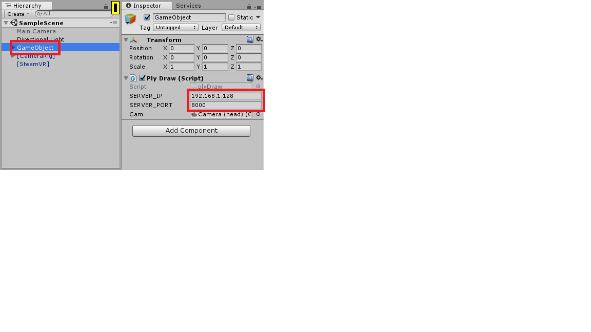

# PCL-Unity

## Overview
This project is a Unity project to draw a group of point cloud data in the virtual world. This project is not designed as a stand-alone module to do the point cloud drawing by file reading. This project is part of ARENA to receive the data stream of point cloud from a server and to draw received point cloud in real time.

## Visualization of Point Cloud
We shows points in the received point cloud data by putting them into a Mesh component in Unity. The application will treat all points received with one transmission as one frame, and it will update the Mesh when it completes receiving new frame from the server. Rather create new Mesh every frame, this application uses share mesh as the only update target to create the mesh update performance.

## Third-Part Mesh Material
The texture used to draw one point is from [Pcx](https://github.com/keijiro/Pcx) project. In this project, we have already imported the Unity package released by Pcx project. If you want to create a project from scratch while using the same point mesh material, please install the [Unity package](https://github.com/keijiro/Pcx/releases) in the new project.

## Server IP/Port Setting
All the operation is implemented in script *plyDraw.cs* and is bound to the *GameObject* in the scene hierarchy. As shown in the screenshot, there are two parameters of GameObject named **SERVER_IP** and **SERVER_PORT** where we can set the server IP and port. After setting the server IP and port number, we can click **Play button** in the Unity to start the application.

